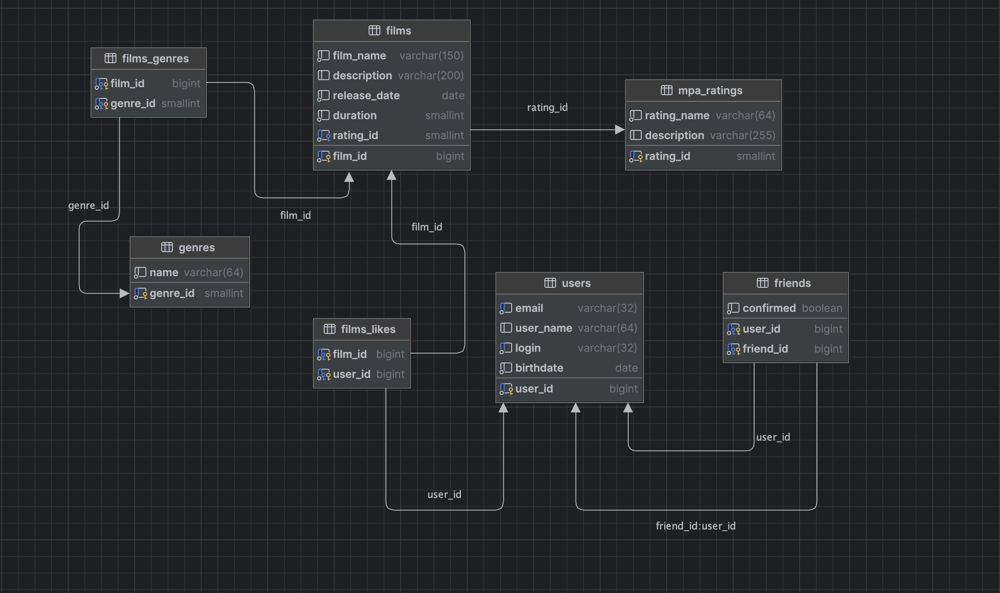

# java-filmorate


## Схема базы данных



Схема базы данных:

- справочники `genres` и `mpa_ratings` хранят фиксированные значения;
- у фильма один MPA-рейтинг (`films.rating_id`) и несколько жанров через `films_genres`;
- лайки хранятся в `films_likes` (M:N film ↔ user);
- дружба хранится в `friends`: одна запись заявки, поле `confirmed` показывает статус
  (`false` — заявка не подтверждена, `true` — подтверждённая дружба).

Создание базы: [`src/main/resources/create_db.sql`](src/main/resources/create_db.sql)  
Создание схемы и таблиц: [`src/main/resources/schema.sql`](src/main/resources/schema.sql)  
Справочные данные: [`src/main/resources/data.sql`](src/main/resources/data.sql)

### Примеры основных запросов

Все пользователи:

```sql
SELECT user_id, email, user_name, login, birthdate
FROM users
ORDER BY user_id;
```

Все фильмы с MPA и жанрами:

```sql
SELECT f.film_id,
       f.film_name,
       m.rating_name AS mpa,
       string_agg(g.name, ', ' ORDER BY g.genre_id) AS genres
FROM films f
         JOIN mpa_ratings m ON m.rating_id = f.rating_id
         LEFT JOIN films_genres fg ON fg.film_id = f.film_id
         LEFT JOIN genres g ON g.genre_id = fg.genre_id
GROUP BY f.film_id, f.film_name, m.rating_name
ORDER BY f.film_id;
```

Топ N популярных фильмов по лайкам:

```sql
SELECT f.film_id,
       f.film_name,
       COUNT(fl.user_id) AS likes_count
FROM films f
         LEFT JOIN films_likes fl ON fl.film_id = f.film_id
GROUP BY f.film_id, f.film_name
ORDER BY likes_count DESC, f.film_id
LIMIT :n;
```

Друзья пользователя (подтверждённые и заявки исходящие):

```sql
SELECT u.user_id, u.login, u.user_name, f.confirmed
FROM friends f
         JOIN users u ON u.user_id = f.friend_id
WHERE f.user_id = :userId
ORDER BY u.user_id;
```

Общие друзья двух пользователей:

```sql
SELECT u.user_id, u.login, u.user_name
FROM friends f1
         JOIN friends f2 ON f1.friend_id = f2.friend_id
         JOIN users u ON u.user_id = f1.friend_id
WHERE f1.user_id = :userId
  AND f2.user_id = :otherId
  AND f1.confirmed
  AND f2.confirmed
ORDER BY u.user_id;
```

Добавить лайк:

```sql
INSERT INTO films_likes (film_id, user_id)
VALUES (:filmId, :userId)
ON CONFLICT DO NOTHING;
```
Добавить заявку в друзья:

```sql
INSERT INTO friends (user_id, friend_id, confirmed)
VALUES (:userId, :friendId, false)
ON CONFLICT (user_id, friend_id) DO NOTHING;
```